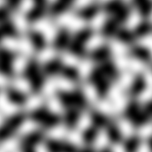
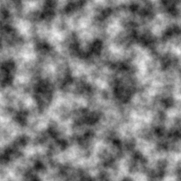
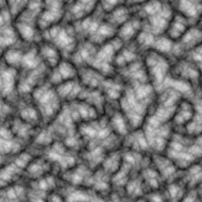

Very Noise
==========
Very Noise (or VNoise) is a simple coherent noise generator that uses the command line. It outputs either 8 or 16 bit grayscale PNG images.

The idea of this project is not to create a fully-fledged procedural texture generator, but to create a basic noise generator that can be used in conjunction with command line image editing tools such as ImageMagick to create more advanced textures.

Use the binary with the --help argument to learn more.

Examples
--------
All examples are built with the same random seed in order to better show the effects of the different parameters.

License
-------
This project (except for simplexnoise1234.h and simplexnoise1234.c, which are in public domain) is licensed under GPLv3. See COPYING for more information.

Note that there is no license imposed on the files generated by this program.

Authors
-------
[Mike Pedersen](https://github.com/Noctune)

simplexnoise1234.c and simplexnoise1234.h by Stefan Gustavson (at stegu@itn.liu.se).
